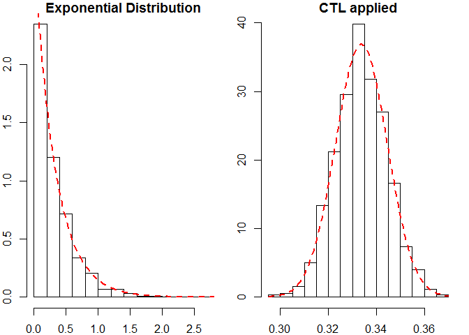
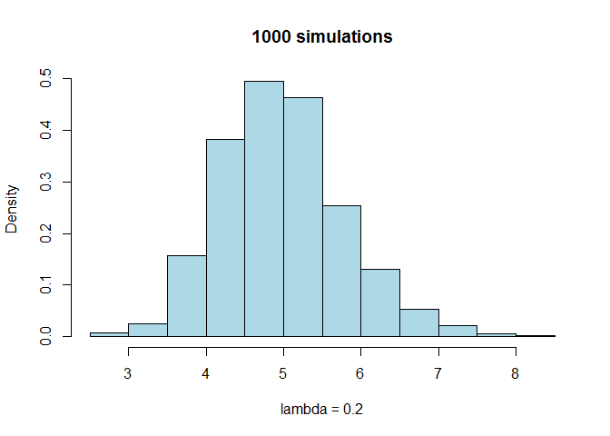
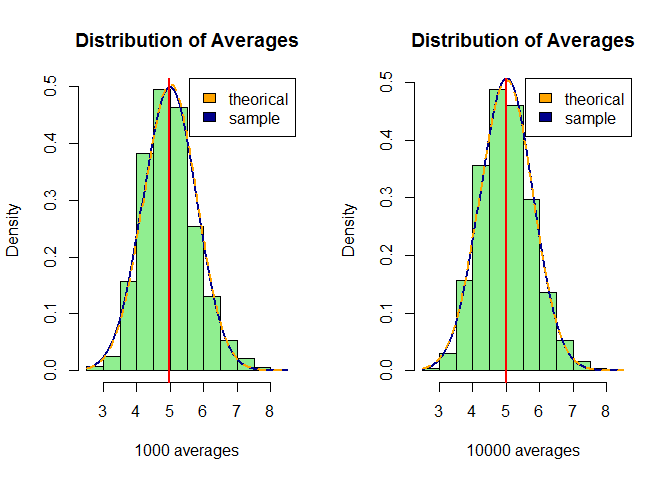

# Exponential Distribution vs Central Limit Theorem


## Sinopsis

In this project we will investigate how the exponential distribution works in R (using function such as __rexp(n, lambda)__ or __pexp(q, lambda)__) and we will compare it to the Central Limit Theorem (or CTL in short). We will be doing this through *simulation*, that is studing the distribution of averages of 40 exponentials repeated thousand times.

## Background 
We draw an Exponential distribution of n = 1000 and lambda = 3 (left panel) and we apply the Central Limit Theorem which states that the distribution of the sum (or average) of a large number of independent, identically distributed variables will be approximately normal (more information could be oibatained [here](http://www.math.uah.edu/stat/sample/CLT.html)). So if **we apply that to our previous data set we should get a normal distribution** (Right panel). 

<!-- -->

## Simulation Results
In this prject we will be simulating the distribution of the mean from 40 exponentials. then we will address the following question:

1. Compare the theorical and the sample mean.
2. Comapre the how variable is our simulated variance to the theorical variance of the distribution.
3. Show that the distribution is approximately normal.

### Theorical and Sample means:
As stated in the Exercise instructions _lambda will be set at 0.2_ and therefore the theorical mean should be:

```r
lambda <- 0.2
tmean <- 1/lambda
print(tmean)
```

```
## [1] 5
```

Now we will simulate our distribution of the 40 exponentials:

```r
set.seed(2016)
n <- 40
sim <- NULL
for (i in 1:1000) sim <- c(sim, mean(rexp(n, rate = lambda)))
```

<!-- -->

And we will calculate the sample mean:

```r
smean <- mean(sim)
print(smean)
```

```
## [1] 4.979186
```

So the mean extracted from our simulation sample is not exactly our theorical mean but they are pretty close:

```r
difference <- tmean - smean
print(difference)
```

```
## [1] 0.0208141
```

### Theorical and sample variances
We will calculate the theorical variance and the variance obtained after our simulation:

```r
# the theorical Variance is:
tsd <- (1/lambda)/sqrt(n)
tvar <- tsd^2
print(tvar) 
```

```
## [1] 0.625
```

```r
# our sample variance is:
svar <- var(sim)
print(svar)
```

```
## [1] 0.6384844
```
So there is only a difference of 

```
## [1] 0.01348445
```

### Is the distribution Normal?
As we pointed out in the backgroud section a large collection of averages of 40 exponentials results in a Normal distribution. Here we will show it with and increased collection of averages:
<!-- -->

Informally called the **bell curve**; we have computed here 100 averages of 40 random samples, and we see here that they are approximately well distributed and beautyful _bell shaped_. As an additional information, note that the shape of the dark-blue bell curve (our sample distribution) is exactly the same as the theorically normal distribution (orange dot line). **Increasing the number of averages (right panel, increased to 10000), results in an almost complete overlapping of the mean and variance values of the theorical and the sample distributions**.

## Appendix (Figures R code)
Here I am presenting the code I have employed to generate the different plots you can see through the project:

1. **Background plots:**  

```r
ex <- rexp(1000, rate = 3)
mns <- NULL
for (i in 1:1000) mns <- c(mns, mean(rexp(1000, rate = 3)))
par(mfrow = c(1, 2), mar = c(2,2,1,1))
hist(ex, xlab = "", main = "Exponential Distribution", prob = TRUE)
curve(dexp(x, rate = 3), col = 2, lty = 2, lwd = 2, add = TRUE)
hist(mns, prob = TRUE, xlab = "", main = "CTL applied")
curve(dnorm(x, mean = mean(mns), sd = sd (mns)), add = TRUE, col = 2, lty = 2, lwd = 2)
```

2. **Theorical and sample means:** 

```r
par(mfrow = c(1, 1))
hist(sim, prob = TRUE, xlab = "lambda = 0.2", main = "1000 simulations", col = "lightblue")
```

3. **Is the distribution Normal?**  

```r
set.seed(2016)
n <- 40
mns <- NULL
for (i in 1:1000) mns <- c(mns, mean(rexp(n, rate = lambda)))
par(mfrow = c(1, 2))
hist(mns, prob = TRUE, xlab = "1000 averages", main = "Distribution of Averages", col = "lightgreen")
curve(dnorm(x, mean = mean(mns), sd = sd (mns)), add = TRUE, col = "darkblue",lwd = 2)
curve(dnorm(x, mean = 5, sd = tsd), add = TRUE, col = "orange", lwd = 2, lty = 2)
abline(v = mean(mns), col = "red", lwd = 2)
legend("topright", c("theorical", "sample"), fill = c("orange", "darkblue"))

mns2 <- NULL
for (i in 1:10000) mns2 <- c(mns2, mean(rexp(n, rate = lambda)))
hist(mns2, prob = TRUE, xlab = "10000 averages", main = "Distribution of Averages", col = "lightgreen")
curve(dnorm(x, mean = mean(mns2), sd = sd (mns2)), add = TRUE, col = "darkblue",lwd = 2)
curve(dnorm(x, mean = 5, sd = tsd), add = TRUE, col = "orange", lwd = 2, lty = 2)
abline(v = mean(mns2), col = "red", lwd = 2)
legend("topright", c("theorical", "sample"), fill = c("orange", "darkblue"))
```

