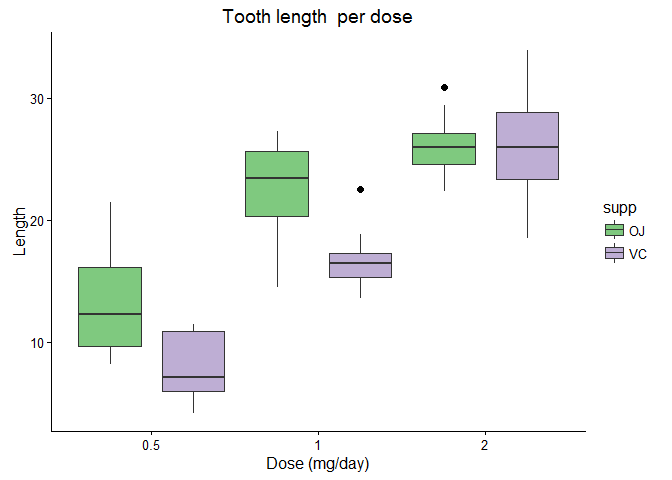

# Analysis of The Effect of Vitamin C on Tooth Growth in Guinea Pigs


## Introduction
In this assignment we will do some Exploratory analysis on the ToothGrowth dataset available in R. To this end we will start loading some libraries that we will need including the dataset in question:

```r
library(datasets)
library(ggplot2) #This will make easy to represent in one plot dose levels and delivery method effects on tooth length.
library(RColorBrewer) #Just to pimp up a bit the plots
```

More information about this dataset can be found [here](https://stat.ethz.ch/R-manual/R-devel/library/datasets/html/ToothGrowth.html). In summary we will be analysing a dataset in data frame format with 3 variables:

1. Tooth length (encoded as *len* variable)
2. Supplement type (encoded as *supp* variable): Delivery method employed including orange juice (OJ) and ascorbic acid (VC)
3. Dose (encode as *dose* variable): Dose stated in milligrams per day, and it takes 3 values 0.5, 1 and 2 mg/day.
So lets confirm this information in R:

```
## 'data.frame':	60 obs. of  3 variables:
##  $ len : num  4.2 11.5 7.3 5.8 6.4 10 11.2 11.2 5.2 7 ...
##  $ supp: Factor w/ 2 levels "OJ","VC": 2 2 2 2 2 2 2 2 2 2 ...
##  $ dose: num  0.5 0.5 0.5 0.5 0.5 0.5 0.5 0.5 0.5 0.5 ...
```
As you can see those three variables are present and we can see that *len* and *dose* are numeric while *supp* is a factor variable. **Note:** To be able to plot and be more efficient in the analysis we will convert the variable *dose* in to a factor:

```r
ToothGrowth$dose <- as.factor(ToothGrowth$dose)
```

##Exploratory Analysis
In order to see how the Tooth length data is distributed, we will not show *dose* and *supp* since *len* variable contains the values we are interested in.

```r
summary(ToothGrowth[1])
```

```
##       len       
##  Min.   : 4.20  
##  1st Qu.:13.07  
##  Median :19.25  
##  Mean   :18.81  
##  3rd Qu.:25.27  
##  Max.   :33.90
```
As we can appreciate the length varies considerably so we can argue that either *dose* or *supp* or both have and impact in the length of odontoblasts.

To gain a better idea of what is going on we will plot the length in relation to the dose administrated and the method employed:

```r
g <- ggplot(ToothGrowth, aes(x=dose, y=len, fill=supp)) +
  geom_boxplot(outlier.colour="black", outlier.shape=16,
             outlier.size=2, notch=FALSE, position=position_dodge(1)) + labs(title="Tooth length  per dose",x="Dose (mg/day)", y = "Length") + theme_classic() + theme(axis.line.x = element_line(colour = 'black', size=0.5, linetype='solid'), axis.line.y = element_line(colour = 'black', size=0.5, linetype='solid'))
final <- g + scale_fill_brewer(palette="Accent")
print(final)
```

<!-- -->

Looking at the plot is easy to deduce why the range of vlues in *len* was so big. Furthermore we can appreciate that the tooth length is affected by the dose administrated and the delivery method. When higher viatmin C doses were administred, tooth length increased but this effect depended on the delivery method. 

##Hypothesis Testing
As we have mentioned both *dose* and *supp* (delivery method) could have affected length measurements. To address this issue we will perform T test analysis (since we are working with a sample of 60 guinea pigs), we will assume that the data is **normaly distribute** and that the varibales are **independent**. We will perform the following analysis:
1. Hypothesis of the delivery method effect.
2. Hypothesis of dose effect.
3. hypothesis of the delivery method on dose effect.

### Delivery method effect
We will assume the *null* hypothesis that there is not effect in tooth length due to the delivery method employed. Our *alternative* hypothesis will be that OJ has higher effect in length than VC.

```r
OJ <- ToothGrowth[ToothGrowth$supp == "OJ",]$len
VC <- ToothGrowth[ToothGrowth$supp == "VC",]$len
t.test(OJ, VC, alternative = "greater")
```

```
## 
## 	Welch Two Sample t-test
## 
## data:  OJ and VC
## t = 1.9153, df = 55.309, p-value = 0.03032
## alternative hypothesis: true difference in means is greater than 0
## 95 percent confidence interval:
##  0.4682687       Inf
## sample estimates:
## mean of x mean of y 
##  20.66333  16.96333
```
As we can see our p value is lower than the type one error of .05, thus we can conclude that **orange juice have an overall significant higher effect in tooth length than the ascorbic acid**. 

###Dose effect
As we did previously our *null* hypothesis is again a lack off effect of the different doses employed, while the *alternative* dictates that the higher the dose the bigger values in tooth length we get. So, we will have to analyze every single dose employed and compare with each other.

```r
dose05 <- ToothGrowth[ToothGrowth$dose == "0.5",]$len 
dose1 <- ToothGrowth[ToothGrowth$dose == "1",]$len
dose2 <- ToothGrowth[ToothGrowth$dose == "2",]$len

#Comapring 0.5 mg/day with 1 mg/day
t.test(dose1, dose05, alternative = "greater")
```

```
## 
## 	Welch Two Sample t-test
## 
## data:  dose1 and dose05
## t = 6.4766, df = 37.986, p-value = 6.342e-08
## alternative hypothesis: true difference in means is greater than 0
## 95 percent confidence interval:
##  6.753323      Inf
## sample estimates:
## mean of x mean of y 
##    19.735    10.605
```

```r
#Comapring 0.5 mg/day with 2 mg/day
t.test(dose2, dose05, alternative = "greater")
```

```
## 
## 	Welch Two Sample t-test
## 
## data:  dose2 and dose05
## t = 11.799, df = 36.883, p-value = 2.199e-14
## alternative hypothesis: true difference in means is greater than 0
## 95 percent confidence interval:
##  13.27926      Inf
## sample estimates:
## mean of x mean of y 
##    26.100    10.605
```

```r
#Comapring 1 mg/day with 2 mg/day
t.test(dose2, dose1, alternative = "greater")
```

```
## 
## 	Welch Two Sample t-test
## 
## data:  dose2 and dose1
## t = 4.9005, df = 37.101, p-value = 9.532e-06
## alternative hypothesis: true difference in means is greater than 0
## 95 percent confidence interval:
##  4.17387     Inf
## sample estimates:
## mean of x mean of y 
##    26.100    19.735
```
So the results clearly state that there are **significant differences in tooth lenght between all the posible combinations of doses administrated**.

###Delivery method and dose effect 
In the previous analysis we grouped both OJ and VC values in our *dose05*, *dose1* and *dose2* variables. Now we will proceed to extend that analysis and confirm what is clearly shown in our plot: the tooth length increase due to dose administration depends on the delivery method employed:

```r
OJdose05 <- subset(ToothGrowth, dose == "0.5" & supp == "OJ")
VCdose05 <- subset(ToothGrowth, dose == "0.5" & supp == "VC")
OJdose1 <- subset(ToothGrowth, dose == "1" & supp == "OJ")
VCdose1 <- subset(ToothGrowth, dose == "1" & supp == "VC")
OJdose2 <- subset(ToothGrowth, dose == "2" & supp == "OJ")
VCdose2 <- subset(ToothGrowth, dose == "2" & supp == "VC")

#Comparison between OJ and VC at 0.5 mg/day dose
t.test(OJdose05$len, VCdose05$len, alternative = "greater")
```

```
## 
## 	Welch Two Sample t-test
## 
## data:  OJdose05$len and VCdose05$len
## t = 3.1697, df = 14.969, p-value = 0.003179
## alternative hypothesis: true difference in means is greater than 0
## 95 percent confidence interval:
##  2.34604     Inf
## sample estimates:
## mean of x mean of y 
##     13.23      7.98
```

```r
#Comaprison between OJ and VC at 1 mg/day dose
t.test(OJdose1$len, VCdose1$len, alternative = "greater")
```

```
## 
## 	Welch Two Sample t-test
## 
## data:  OJdose1$len and VCdose1$len
## t = 4.0328, df = 15.358, p-value = 0.0005192
## alternative hypothesis: true difference in means is greater than 0
## 95 percent confidence interval:
##  3.356158      Inf
## sample estimates:
## mean of x mean of y 
##     22.70     16.77
```

```r
#Comaprison between OJ and VC at 2 mg/day dose
t.test(OJdose2$len, VCdose2$len, alternative = "greater")
```

```
## 
## 	Welch Two Sample t-test
## 
## data:  OJdose2$len and VCdose2$len
## t = -0.046136, df = 14.04, p-value = 0.5181
## alternative hypothesis: true difference in means is greater than 0
## 95 percent confidence interval:
##  -3.1335     Inf
## sample estimates:
## mean of x mean of y 
##     26.06     26.14
```

```r
#Comaprison between 0.5 and 1 mg/day when OJ used
t.test(OJdose1$len, OJdose05$len, alternative = "greater")
```

```
## 
## 	Welch Two Sample t-test
## 
## data:  OJdose1$len and OJdose05$len
## t = 5.0486, df = 17.698, p-value = 4.392e-05
## alternative hypothesis: true difference in means is greater than 0
## 95 percent confidence interval:
##  6.214316      Inf
## sample estimates:
## mean of x mean of y 
##     22.70     13.23
```

```r
#comaprison between 0.5 and 2 mg/day when OJ used
t.test(OJdose2$len, OJdose05$len, alternative = "greater")
```

```
## 
## 	Welch Two Sample t-test
## 
## data:  OJdose2$len and OJdose05$len
## t = 7.817, df = 14.668, p-value = 6.619e-07
## alternative hypothesis: true difference in means is greater than 0
## 95 percent confidence interval:
##  9.94845     Inf
## sample estimates:
## mean of x mean of y 
##     26.06     13.23
```

```r
#Comaprison between 1 and 2 mg/day when OJ used
t.test(OJdose2$len, OJdose1$len, alternative = "greater")
```

```
## 
## 	Welch Two Sample t-test
## 
## data:  OJdose2$len and OJdose1$len
## t = 2.2478, df = 15.842, p-value = 0.0196
## alternative hypothesis: true difference in means is greater than 0
## 95 percent confidence interval:
##  0.7486236       Inf
## sample estimates:
## mean of x mean of y 
##     26.06     22.70
```

```r
#Comaprison between 0.5 and 1 mg/day when VC used
t.test(VCdose1$len, VCdose05$len, alternative = "greater")
```

```
## 
## 	Welch Two Sample t-test
## 
## data:  VCdose1$len and VCdose05$len
## t = 7.4634, df = 17.862, p-value = 3.406e-07
## alternative hypothesis: true difference in means is greater than 0
## 95 percent confidence interval:
##  6.746867      Inf
## sample estimates:
## mean of x mean of y 
##     16.77      7.98
```

```r
#Comaprison between 0.5 and 2 mg/day when VC used
t.test(VCdose2$len, VCdose05$len, alternative = "greater")
```

```
## 
## 	Welch Two Sample t-test
## 
## data:  VCdose2$len and VCdose05$len
## t = 10.388, df = 14.327, p-value = 2.341e-08
## alternative hypothesis: true difference in means is greater than 0
## 95 percent confidence interval:
##  15.08583      Inf
## sample estimates:
## mean of x mean of y 
##     26.14      7.98
```

```r
#Comaprison between 1 and 2 mg/day when VC used
t.test(VCdose2$len, VCdose1$len, alternative = "greater")
```

```
## 
## 	Welch Two Sample t-test
## 
## data:  VCdose2$len and VCdose1$len
## t = 5.4698, df = 13.6, p-value = 4.578e-05
## alternative hypothesis: true difference in means is greater than 0
## 95 percent confidence interval:
##  6.346525      Inf
## sample estimates:
## mean of x mean of y 
##     26.14     16.77
```
Summarising the results here obtained we can conclude that there are significant differences in tooth length when different doses using different delivery options are given to the Guinea Pigs, meaning **significant differences between doses administrated using same method (either VC or OJ), or between delivery methods when the same dose is administrated, but at 2 mg/day doses of Vitamin C, there are no significant differences (p = 0.5181) in lenght between the delivery methods (OJ or VC)**.

## Conclusions
As we have seen **Vitamin C does affect tooth lenght**, and this effect is **dose and delivery method dependent**. Our analysis is bases in T test as we assume normality in the distribution of independent variables, unequal variances and sample size. 
